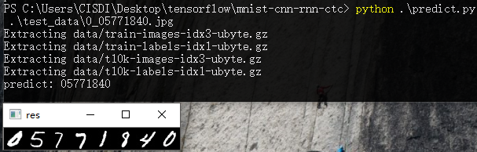

## mnist with rnn

### Requirements

 * python 3.5+
 * tensorflow (version >= 1.4)
 * numpy
 * opencv 3.2.0

### Data
、、

### Predict

```
python predict.py image_path
```

#### example:

```
python predict.py test_data/0_05771840.jpg
```

#### result


### Train

```
python train.py
```

